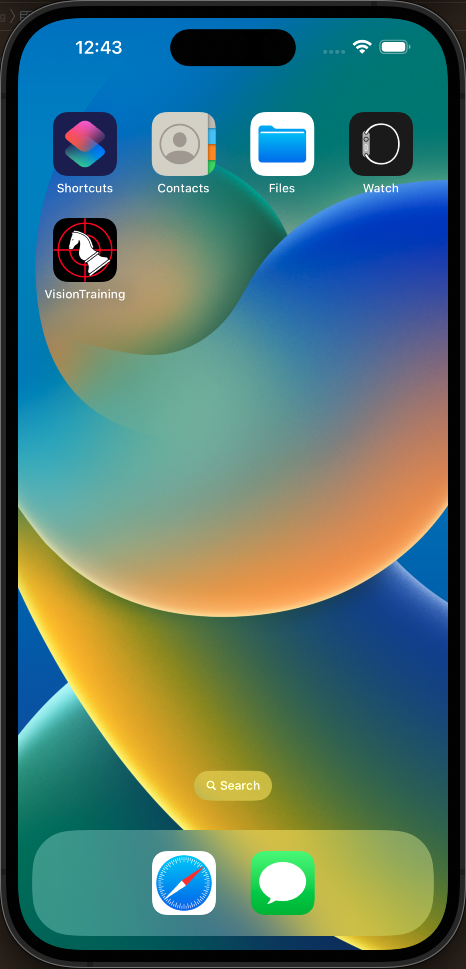
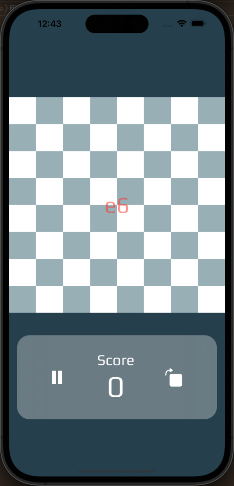
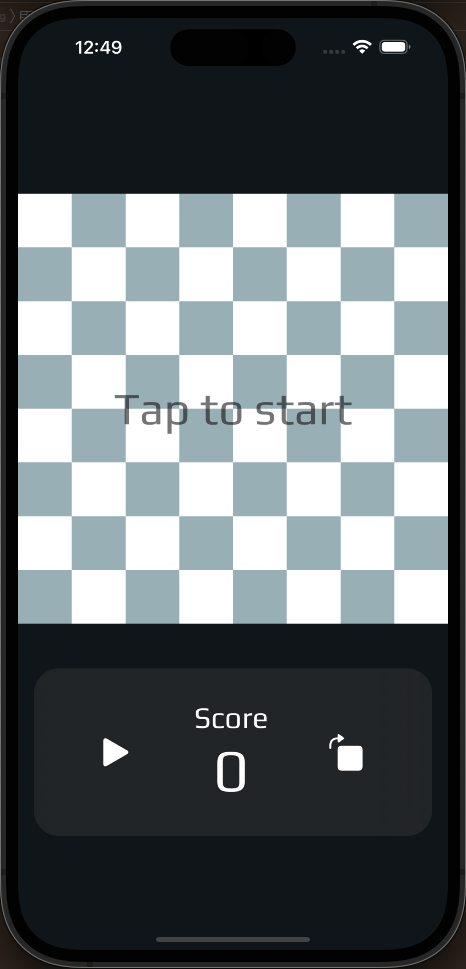

# SwiftUI Vision Trainer

## Overview
This application is designed for chess players who want to improve their awareness of the chess board. The program helps users track their score and provides notifications when they select an incorrect square on the board.

## Features
- Start a game and track your score
- Receive notifications when you choose a wrong square
- Change perspective from white to black with a single click
- Light and dark mode options
- Responsive to different iPhone sizes

## Design Patterns
This program uses the MVVM and Singleton design patterns for a clean and easy to use experience.

## Usage
1. Start the game and track your score
2. Receive notifications when you choose a wrong square
3. Change perspective from white to black with a single click
4. Choose between light and dark mode

Note: This program is still in development and more features will be added in future updates.

  
   
   

  
  
  

